Presenting Data 1: Plotting Conditional Means
=============================================

The idea when plotting conditional means is to show how the outcome, or variable of interest, varies as a function of predictors.

Today we'll be working with a dataset from IBM which provide a standard HR dataset, which we can use to predict attrition. Attrition in this case is defined as an employee leaving without being fired or retiring. Companies generally attempt to avoid attrition, as it's very expensive to search for and hire a replacement-- better in general to keep the employees you have, provided they are doing their jobs. This means that it's important to predict who might leave in a given year. This information can be used in a targeted way in order to focus resources on the employees most likely to leave.

Setup for plotting conditional means
------------------------------------

We start with a standard set of setup commands. Today we'll be working with `tidyverse`, as usual, along with a library called `forcats` which helps us to deal with the dreaded factor variables. To handle colors, we'll need the package `RColorBrewer.`

Next we load in the data, using the `readr` package. Note that this data is saved as comma separated or `csv.` This is an easy file format to recognize. When we use the `readr` package, it gives us some output that says how it interprets the data-- is it a string variable, numeric (float), integer and so on.

Loading Data
------------

``` r
at<-read_csv("https://community.watsonanalytics.com/wp-content/uploads/2015/03/WA_Fn-UseC_-HR-Employee-Attrition.csv")
```

    ## Parsed with column specification:
    ## cols(
    ##   .default = col_integer(),
    ##   Attrition = col_character(),
    ##   BusinessTravel = col_character(),
    ##   Department = col_character(),
    ##   EducationField = col_character(),
    ##   Gender = col_character(),
    ##   JobRole = col_character(),
    ##   MaritalStatus = col_character(),
    ##   Over18 = col_character(),
    ##   OverTime = col_character()
    ## )

    ## See spec(...) for full column specifications.

``` r
## Save for later
save(at,file="at.Rdata")

## Load the saved version (not necessary, just showing we can!)
load("at.Rdata")
```

Today, our primary outcome of interest will be attrition. This is a binary variable that is currently encoded as text-- "Yes" or "No." We need to encode it as a binary variable with 1 meaning yes and 0 meaning no. After recoding, we need to make sure that the new variable looks correct.

``` r
## Crate a new variable named attrit and define it as 0
at<-at%>%mutate(attrit=ifelse(Attrition=="Yes",1,0))

table(at$Attrition)
```

    ## 
    ##   No  Yes 
    ## 1233  237

``` r
table(at$attrit)
```

    ## 
    ##    0    1 
    ## 1233  237

``` r
table(at$attrit,at$Attrition)
```

    ##    
    ##       No  Yes
    ##   0 1233    0
    ##   1    0  237

Univariate Graphics
-------------------

Univariate graphics help us understand what individual variables look like-- how are they distibuted across the sample? Here's a quick rundown on some univariate graphics. Say we wanted a quick count of who was in each department. We can use geom\_bar to get this done. By default, this will give us a count in each department.

``` r
gg<-ggplot(at,aes(x=Department,fill=Department))
gg<-gg+geom_bar()
gg
```

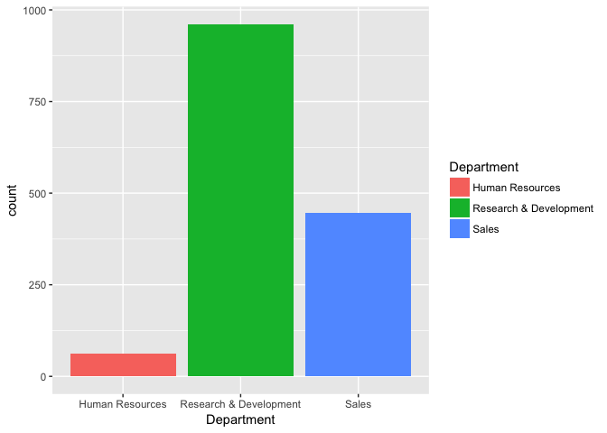

The next univariate graphic you should know is for continuous variables. The first thing you generally want is a histogram.

``` r
gg<-ggplot(at,aes(x=DistanceFromHome))
gg<-gg+geom_histogram(binwidth = 1,fill="lightblue")
gg
```

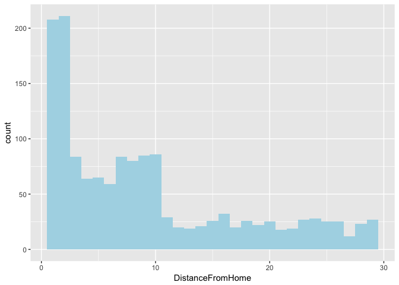 Density plots provide a continous graphic of the distribution of a variable:

``` r
gg<-ggplot(at,aes(x=DistanceFromHome))
gg<-gg+geom_density()
gg
```

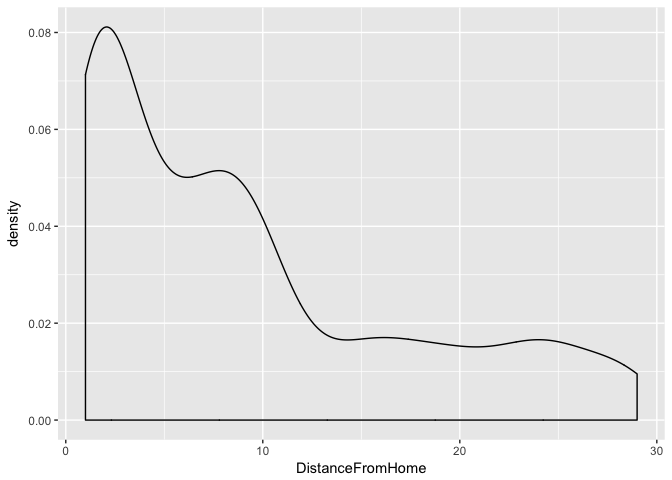

``` r
## Changing bandwidth-- not recommended, just showing you how. 
gg<-gg+geom_density(bw=10)
gg
```

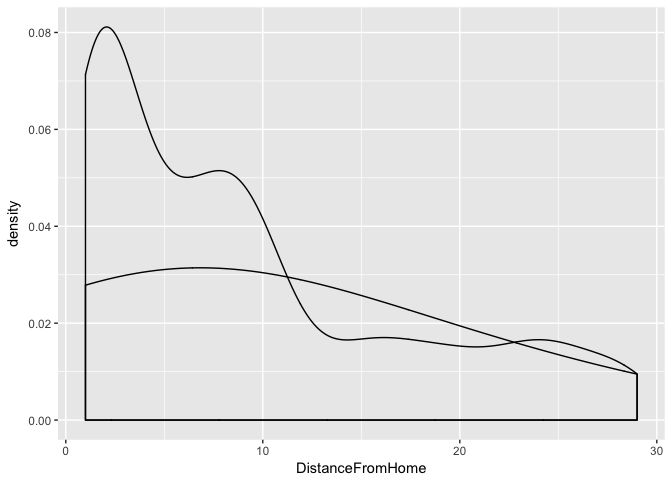

Predicting Attrition
--------------------

Our first prediction will use business travel as a predictor for attrition. There are three categories here-- non travel, travel infrequently, and frequent travel. We'll calculate levels of attrtion at teach level and then take a look at the data.

``` r
at_sum<-at%>%
  group_by(BusinessTravel)%>%
  summarize(attr_avg=mean(attrit))

at_sum
```

    ## # A tibble: 3 × 2
    ##      BusinessTravel  attr_avg
    ##               <chr>     <dbl>
    ## 1        Non-Travel 0.0800000
    ## 2 Travel_Frequently 0.2490975
    ## 3     Travel_Rarely 0.1495686

Remember that the mean of a binary variable indicates the proportion of the population that has a certain characteristcs. So, in our case, 0.25 of the sample that travels frequently left the company in the last year. Our first plot will be a basic bar plot, showing the average levels of attrition.

``` r
## Bar Plot with aesthetics: mean attrition as height, business travel as cateogry
gg<-ggplot(at_sum,aes(x=BusinessTravel,y=attr_avg))
## Use bar plot geometry, height of bars set by level observed in dataset
gg<-gg+geom_bar(stat="Identity")
## Print
gg
```

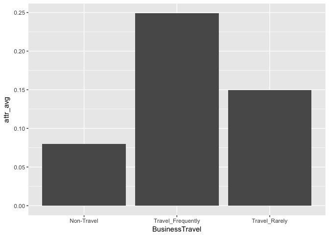

This is fine, but it should really be in the order of the underlying variable. We can use `fct_reorder` to do this.

*Side* *Note*

What is a factor variable? In R, factor variables are used for categorical data. These are data elements that can take on one and only one value of a mutually exclusive and exhaustive list of elements. In our case, the travel variable is a factor-- employees can be in Non-Travel, Travel Frequently or Travel Rarely bins. Everyone is one bin, and the bins cover all possible options. We use factors when numbers won't work-- for characteristics like race or religion or political affiliation.

``` r
## Same asethetics, but now orderred by level
gg<-ggplot(at_sum,aes(x=fct_reorder(BusinessTravel,attr_avg),y=attr_avg))

gg<-gg+geom_bar(stat="identity")

## Labeling
gg<-gg+xlab("Amount of Travel")+ylab("Yearly Attrition")
##Print
gg
```

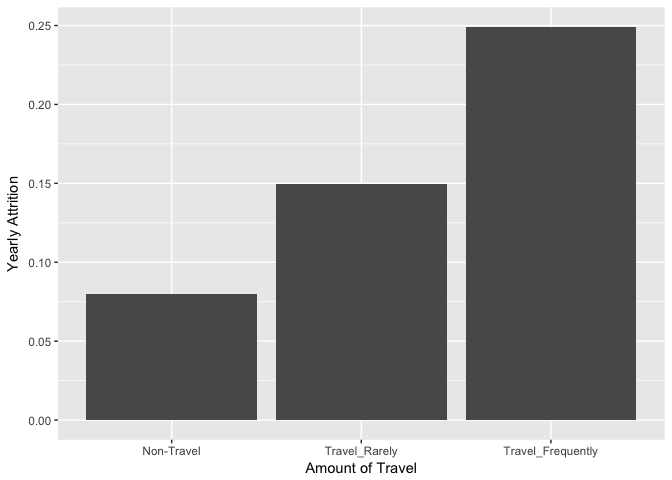

*Quick Exercise: Create a bar plot showing average attrition by department instead of travel*

``` r
at_sum<-at%>%
  group_by(Department)%>%
  summarize(attr_avg=mean(attrit))

at_sum
```

    ## # A tibble: 3 × 2
    ##               Department  attr_avg
    ##                    <chr>     <dbl>
    ## 1        Human Resources 0.1904762
    ## 2 Research & Development 0.1383975
    ## 3                  Sales 0.2062780

``` r
gg<-ggplot(at_sum,aes(x=fct_reorder(Department,attr_avg),y=attr_avg))

gg<-gg+geom_bar(stat="identity")

## Labeling
gg<-gg+xlab("Department")+ylab("Yearly Attrition")
##Print
gg
```

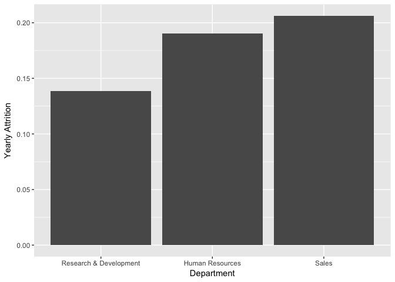

A dot plot can be a good way of displaying conditional means as well. Many times dot plots are more easily understood if they are horizontal, so we'll use `coord_flip` to make it horizontal.

``` r
at_sum<-at%>%
  group_by(BusinessTravel)%>%
  summarize(attr_avg=mean(attrit))

at_sum
```

    ## # A tibble: 3 × 2
    ##      BusinessTravel  attr_avg
    ##               <chr>     <dbl>
    ## 1        Non-Travel 0.0800000
    ## 2 Travel_Frequently 0.2490975
    ## 3     Travel_Rarely 0.1495686

``` r
## Now a dot plot
gg<-ggplot(at_sum,aes(x=reorder(BusinessTravel,-attr_avg),y=attr_avg))
gg<-gg+geom_point()
gg<-gg+coord_flip()
gg
```

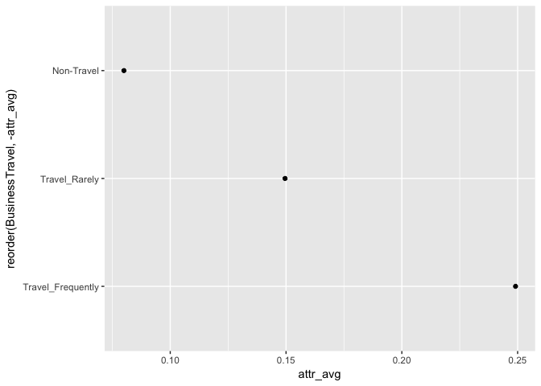

*Quick Exercise: Create a dot plot showing average attrition by department*

Conditional means using two predictors
--------------------------------------

We can use graphics to display conditonal means at multiple levels of predictor levels. There are a couple of ways to get this done. When using bar plots we've got two basic tools: location and color. In the first example, we're going to plot attrition by travel and gender, We'll use color to indicate gender, and location to indicate travel.

``` r
## Summarize attrition by travel AND gender
at_sum<-at%>%
  group_by(BusinessTravel,Gender)%>%
  summarize(attr_avg=mean(attrit))

## Get the results
at_sum
```

    ## Source: local data frame [6 x 3]
    ## Groups: BusinessTravel [?]
    ## 
    ##      BusinessTravel Gender   attr_avg
    ##               <chr>  <chr>      <dbl>
    ## 1        Non-Travel Female 0.06122449
    ## 2        Non-Travel   Male 0.08910891
    ## 3 Travel_Frequently Female 0.25641026
    ## 4 Travel_Frequently   Male 0.24375000
    ## 5     Travel_Rarely Female 0.12796209
    ## 6     Travel_Rarely   Male 0.16425121

``` r
## PLot it using a bar plot
gg<-ggplot(at_sum,aes(x=fct_reorder(BusinessTravel,attr_avg),y=attr_avg,color=Gender))
gg<-gg+geom_bar(stat="identity",aes(fill=Gender),position="dodge")
gg
```

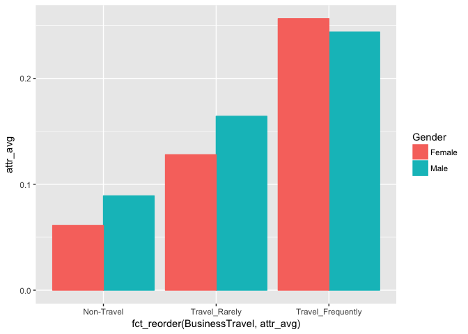

``` r
## Plot it using a dot plot
gg<-ggplot(at_sum,aes(x=reorder(BusinessTravel,attr_avg),y=attr_avg),color=Gender)
gg<-gg+geom_point(aes(color=Gender))
gg<-gg+coord_flip()
gg
```

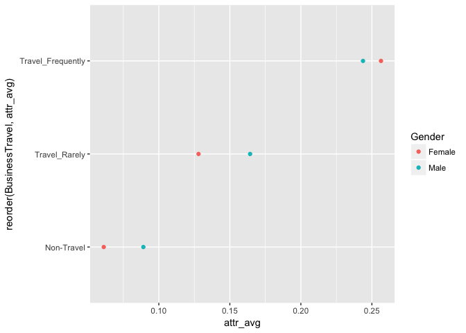

*Quick Exercise: Create either a bar plot or a dot plot showing attrition by department AND field of education*

MOAR Variables: faceting
------------------------

We can continue this logic with three variables. Now we're going to summarize by Travel, Gender and Marital status. Here we're going to use an additional tool in our arsenal: Faceting. Faceting means making multiple graphs with the same structure. In the code below, we will arrange positions based on travel, color based on gender, and then split the graphic by marital status.

``` r
at_sum<-at%>%
  group_by(BusinessTravel,Gender,MaritalStatus)%>%
  summarize(attr_avg=mean(attrit))

at_sum
```

    ## Source: local data frame [18 x 4]
    ## Groups: BusinessTravel, Gender [?]
    ## 
    ##       BusinessTravel Gender MaritalStatus   attr_avg
    ##                <chr>  <chr>         <chr>      <dbl>
    ## 1         Non-Travel Female      Divorced 0.00000000
    ## 2         Non-Travel Female       Married 0.00000000
    ## 3         Non-Travel Female        Single 0.20000000
    ## 4         Non-Travel   Male      Divorced 0.03030303
    ## 5         Non-Travel   Male       Married 0.08333333
    ## 6         Non-Travel   Male        Single 0.15625000
    ## 7  Travel_Frequently Female      Divorced 0.20833333
    ## 8  Travel_Frequently Female       Married 0.13636364
    ## 9  Travel_Frequently Female        Single 0.38775510
    ## 10 Travel_Frequently   Male      Divorced 0.20512821
    ## 11 Travel_Frequently   Male       Married 0.17567568
    ## 12 Travel_Frequently   Male        Single 0.38297872
    ## 13     Travel_Rarely Female      Divorced 0.04878049
    ## 14     Travel_Rarely Female       Married 0.12195122
    ## 15     Travel_Rarely Female        Single 0.18518519
    ## 16     Travel_Rarely   Male      Divorced 0.10869565
    ## 17     Travel_Rarely   Male       Married 0.12714777
    ## 18     Travel_Rarely   Male        Single 0.26041667

``` r
gg<-ggplot(at_sum,aes(x=reorder(BusinessTravel,attr_avg),
                      y=attr_avg,
                      fill=Gender))
## Bar plot, with unstacked (dodge)
 gg<-gg+geom_bar(stat="identity",position="dodge")
## Separate out by Marital Status
gg<-gg+facet_wrap(~MaritalStatus)
## Change orientation to sideways
gg<-gg+coord_flip()
## Print
gg
```

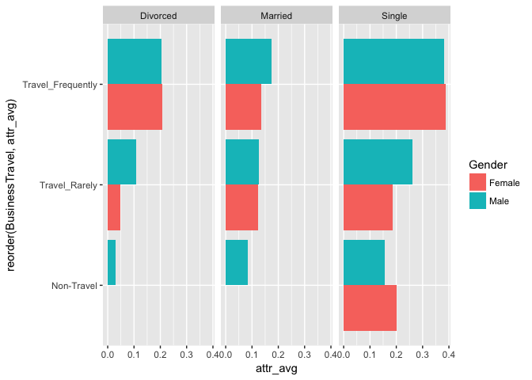

*Side* *Note*: Colors

What if we want to change colors? This is a little tricky for most people at first. `ggplot` thinks in terms of palettes, so you need to associate a palette with a characteristics of the graphic. Below, I replace the default palette with my own ugly one.

``` r
## Changing Colors
mypal<-c("lightblue","orange")

gg<-gg+scale_fill_manual(values =mypal )
## Print
gg
```

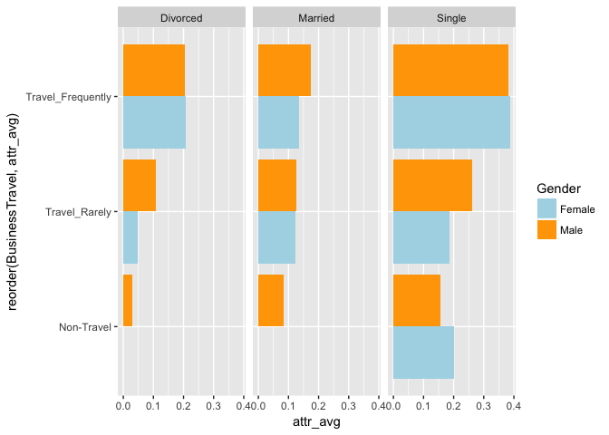

You can also use `RColorBrewer` which has a wide variety of palettes already built. Below I use the qualitative palette creatively named "Set1".

``` r
## Another way, using color brewer palettes: 
gg<-gg+scale_fill_brewer(palette = "Set1")
```

    ## Scale for 'fill' is already present. Adding another scale for 'fill',
    ## which will replace the existing scale.

``` r
gg
```

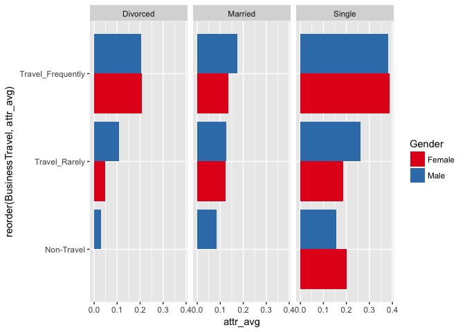

*Quick Exercise: Plot predicted attrition by Education Field, Department and Gender*

Multiple Predictors for Conditional Means
-----------------------------------------

Once you get past three variables, things can get difficult. One solution is to create a new factor with one level for every single level of the predictor variables.

``` r
##This gets a little nutty
at_sum<-at%>%
  group_by(BusinessTravel,Gender,MaritalStatus,WorkLifeBalance)%>%
  summarize(attr_avg=mean(attrit))%>%
  ungroup()%>%
  arrange(attr_avg)

at_sum
```

    ## # A tibble: 70 × 5
    ##    BusinessTravel Gender MaritalStatus WorkLifeBalance attr_avg
    ##             <chr>  <chr>         <chr>           <int>    <dbl>
    ## 1      Non-Travel Female      Divorced               2        0
    ## 2      Non-Travel Female      Divorced               3        0
    ## 3      Non-Travel Female      Divorced               4        0
    ## 4      Non-Travel Female       Married               1        0
    ## 5      Non-Travel Female       Married               2        0
    ## 6      Non-Travel Female       Married               3        0
    ## 7      Non-Travel Female       Married               4        0
    ## 8      Non-Travel Female        Single               1        0
    ## 9      Non-Travel Female        Single               3        0
    ## 10     Non-Travel   Male      Divorced               2        0
    ## # ... with 60 more rows

``` r
## One Solution: a new variable for every type of employee defined by travel, gender, marital status, and happiness with work/life

at_sum$grouping<-paste0(at_sum$BusinessTravel,
                       ", ",
                       at_sum$Gender,
                       ", ",
                       at_sum$MaritalStatus,
                       ", Work/Life:",
                       at_sum$WorkLifeBalance)

at_sum$grouping<-as.factor(at_sum$grouping)

at_sum%>%select(grouping,attr_avg)
```

    ## # A tibble: 70 × 2
    ##                                     grouping attr_avg
    ##                                       <fctr>    <dbl>
    ## 1  Non-Travel, Female, Divorced, Work/Life:2        0
    ## 2  Non-Travel, Female, Divorced, Work/Life:3        0
    ## 3  Non-Travel, Female, Divorced, Work/Life:4        0
    ## 4   Non-Travel, Female, Married, Work/Life:1        0
    ## 5   Non-Travel, Female, Married, Work/Life:2        0
    ## 6   Non-Travel, Female, Married, Work/Life:3        0
    ## 7   Non-Travel, Female, Married, Work/Life:4        0
    ## 8    Non-Travel, Female, Single, Work/Life:1        0
    ## 9    Non-Travel, Female, Single, Work/Life:3        0
    ## 10   Non-Travel, Male, Divorced, Work/Life:2        0
    ## # ... with 60 more rows

``` r
at_sum<-at_sum%>%filter(attr_avg>.01)

gg<-ggplot(at_sum,aes(x=fct_reorder(grouping,attr_avg),y=attr_avg))
gg<-gg+geom_bar(stat="identity",aes(fill=MaritalStatus))
gg<-gg+coord_flip()
gg
```

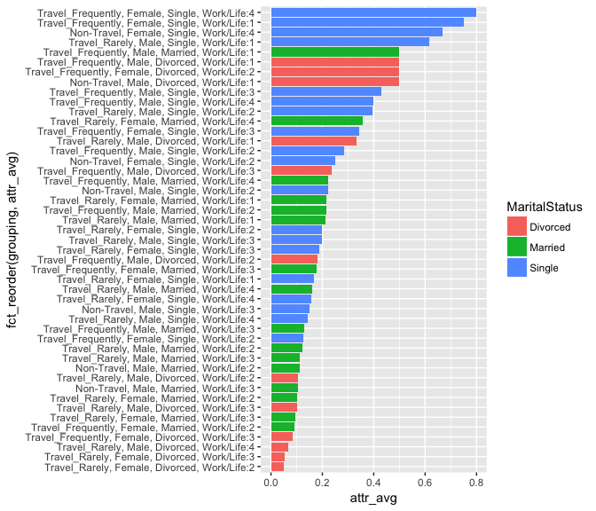

``` r
##Cleaning up a bit

gg<-ggplot(at_sum,aes(x=fct_reorder(grouping,attr_avg),y=attr_avg))
gg<-gg+geom_bar(stat="identity",aes(fill=MaritalStatus))
gg<-gg+ylab("Proportion of Employees Who Departed")+xlab("Category")
gg<-gg+coord_flip()
gg
```

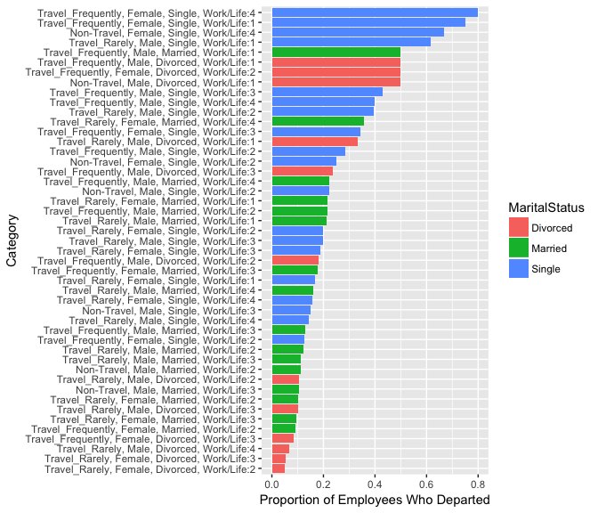

The other solution is to use facets, or lots of little graphs, which show how the pattern varies across different groups. In this case, our groups will be defined by gender and work/life balance.

``` r
## Using Facets

at_sum<-at%>%
  group_by(BusinessTravel,Gender,MaritalStatus,WorkLifeBalance)%>%
  summarize(attr_avg=mean(attrit))%>%
  ungroup()%>%
  arrange(attr_avg)

at_sum
```

    ## # A tibble: 70 × 5
    ##    BusinessTravel Gender MaritalStatus WorkLifeBalance attr_avg
    ##             <chr>  <chr>         <chr>           <int>    <dbl>
    ## 1      Non-Travel Female      Divorced               2        0
    ## 2      Non-Travel Female      Divorced               3        0
    ## 3      Non-Travel Female      Divorced               4        0
    ## 4      Non-Travel Female       Married               1        0
    ## 5      Non-Travel Female       Married               2        0
    ## 6      Non-Travel Female       Married               3        0
    ## 7      Non-Travel Female       Married               4        0
    ## 8      Non-Travel Female        Single               1        0
    ## 9      Non-Travel Female        Single               3        0
    ## 10     Non-Travel   Male      Divorced               2        0
    ## # ... with 60 more rows

``` r
gg<-ggplot(at_sum,aes(x=fct_reorder(BusinessTravel,attr_avg),y=attr_avg))
gg<-gg+geom_bar(stat="identity",aes(fill=MaritalStatus),position="dodge")
gg<-gg+facet_wrap(~Gender+WorkLifeBalance,ncol=4)


gg<-gg+ylab("Proportion of Employees Who Departed")+xlab("Category")
gg<-gg+theme(axis.text.x = element_text(angle = 60, hjust = 1))
gg<-gg+ggtitle("Departure by Gender and Level of Work/Life Satisfaction")
gg
```

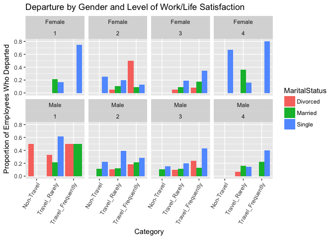

*Sort of Quick Exercise: Try and Replicate one of the above plots using performance review, department, education field and overtime. *
